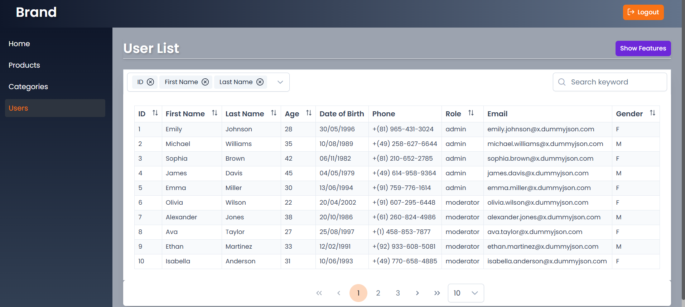
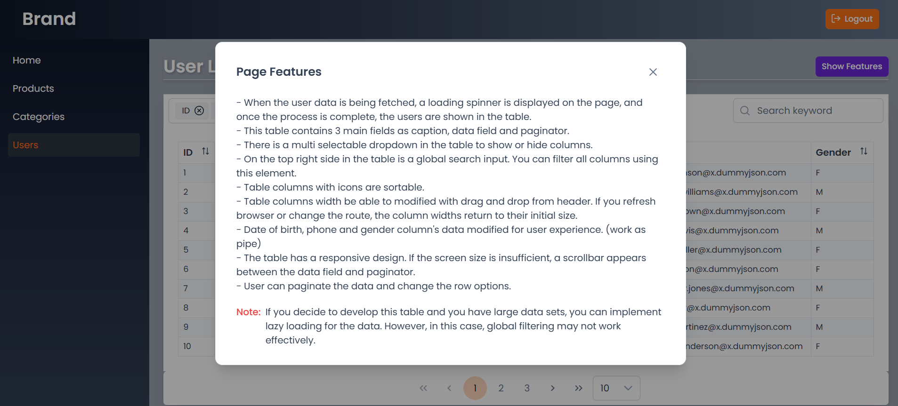
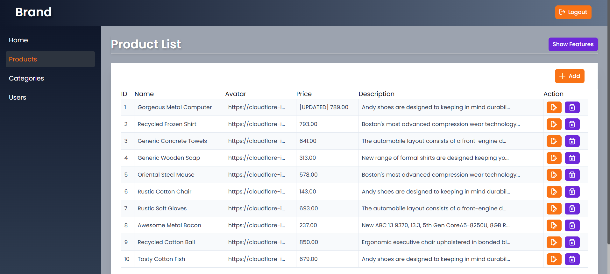
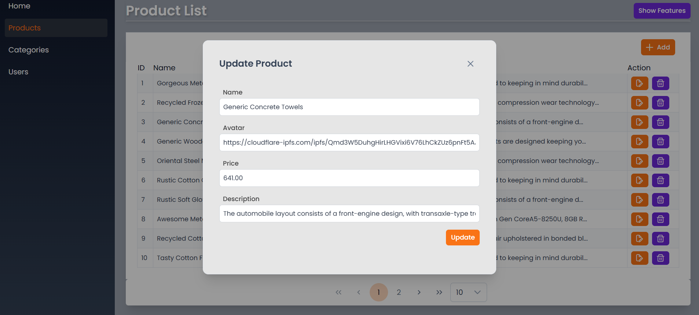
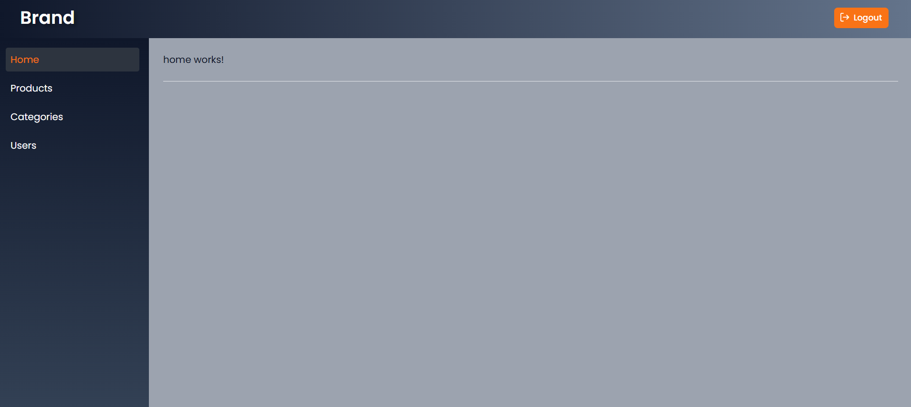

- https://dummyjson.com/docs -> users page
- https://656b0e9cdac3630cf7279f4e.mockapi.io/products -> products page 
    get: /products, 
    single get : /products/id,  
    post: /products ,
    put: /products/id
    delete: products/id

## 🖼️ Screenshots

---